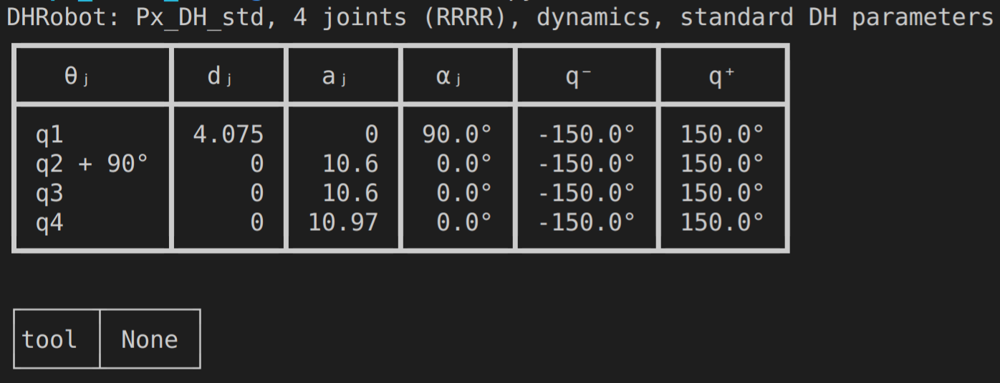
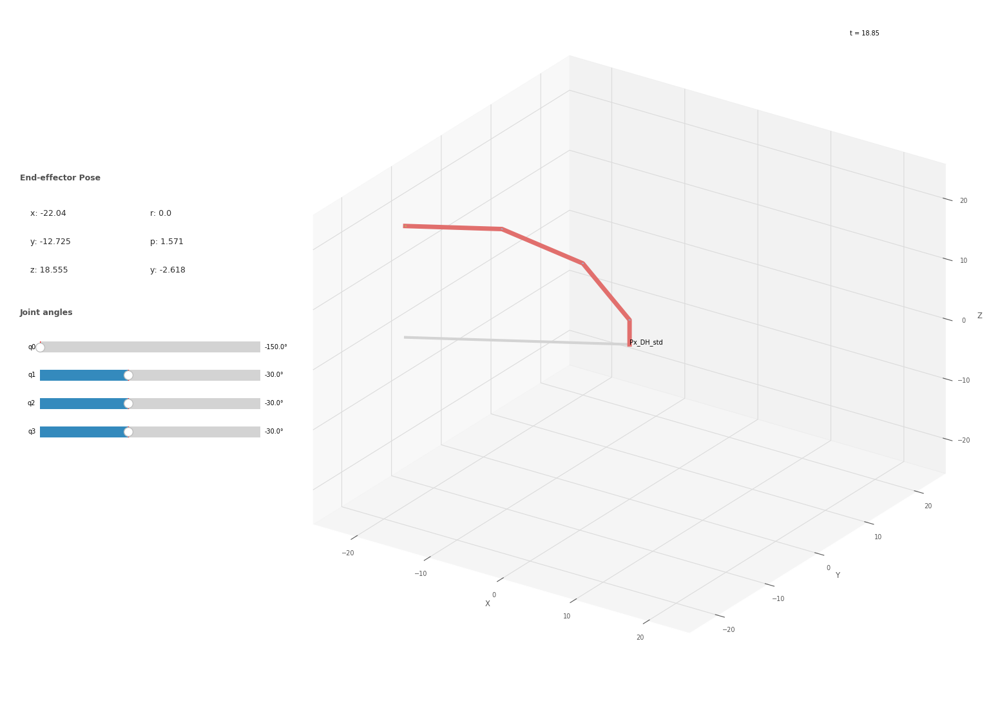
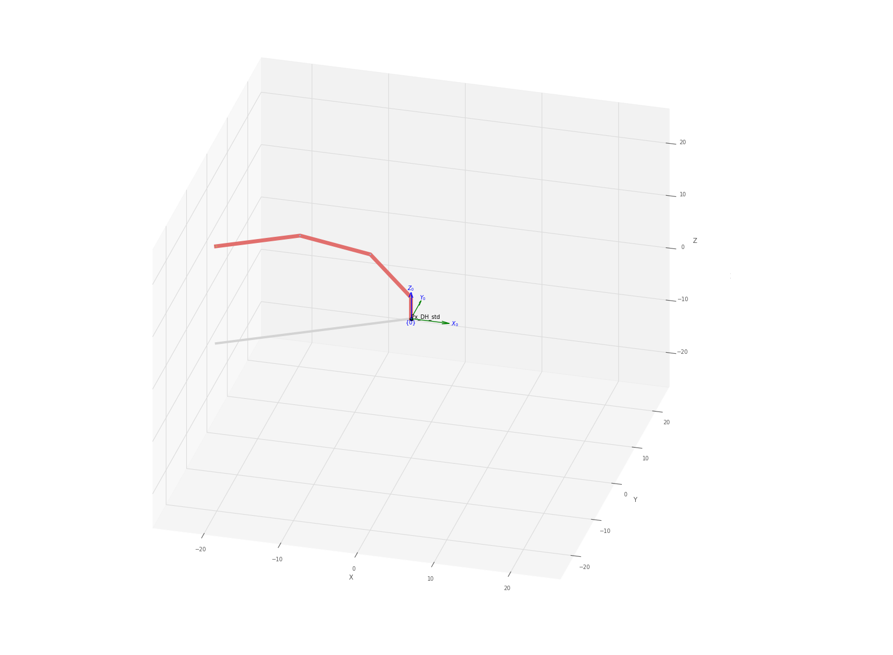
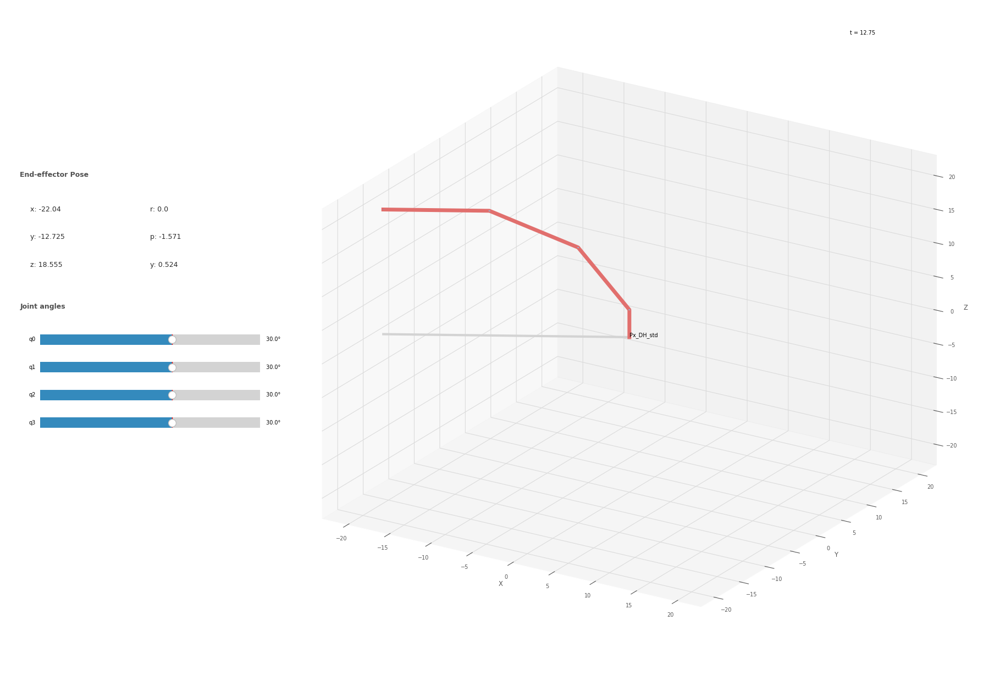
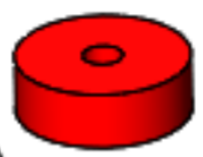
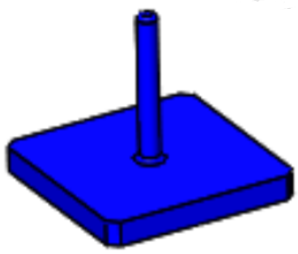
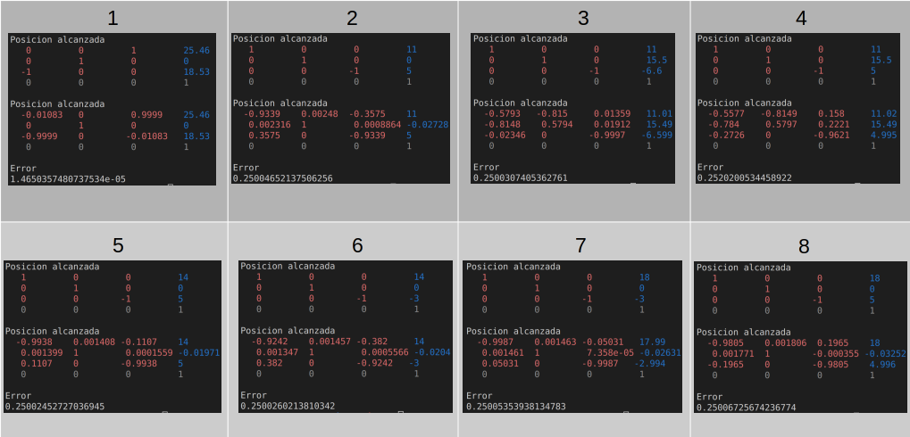
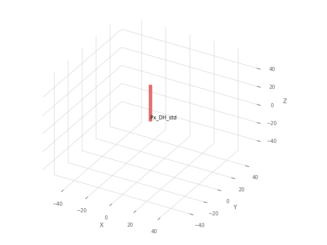

# Cinematica inversa Phamtom X usando Robotic Tool box para python y ROS

## Modelo de cinemática inversa por método geométrico

### Importación de librerías

Para las librerías inicialmente se importa la toolbox de robótica de Peter Corke para Python junto con sus funciones de álgebra espacial. Es necesario también numpy, pues se va a trabajar operaciones matriciales a lo largo del código.  Se utilizan también librerías para el ploteo y delay. 

La última importación es una función propia que fue creada para solucionar un inconveniente que veremos mas adelante en el uso de la cinemática inversa numérica en trayectorias.

```py
import roboticstoolbox as rtb
from spatialmath import *
from spatialmath.base import *
import numpy as np
from sympy import print_ccode
import matplotlib.pyplot as plt
import time
from smooth import smooth
```
## Creación del robot
Lo primero a realizar es la definición del robot junto con sus Parametros DH.

```py
l = np.array([4.075, 10.6, 10.6, 10.97])
limit = 5*np.pi/6
#qlims = np.array([[-np.pi, np.pi],[-np.pi, np.pi],[-np.pi, np.pi],[-np.pi, np.pi]])
qlims = np.array([[-limit, limit],[-limit, limit],[-limit, limit],[-limit, limit]])
robot = rtb.DHRobot(
[rtb.RevoluteDH(alpha=np.pi/2, d=l[0], qlim=qlims[0,:]),
rtb.RevoluteDH(a=l[1], offset=np.pi/2, qlim=qlims[0,:]),
rtb.RevoluteDH(a=l[2], qlim=qlims[0,:]),
rtb.RevoluteDH(a=l[3], qlim=qlims[0,:])],
name="Px_DH_std")
robot.tool = np.array([[0,0,1,0], [-1,0,0,0],[0,-1,0,0], [0,0,0,1]])
print(robot)
```
Lo que genera el siguente robot:

Que la herramienta aparezca como `None` es un error de la toolbox, más adelante se comprobara que la herramienta sí esta siendo tenida en cuenta en los calculos de posición.

Posterior a esto definimos una posición objetivo sobre la cual calcularemos su cinemática directa solo con el objetivo, esto con el objetivo de obtener la matriz de transformación de la posición deseada y comprobar la cinemática inversa.
```py
qt = np.deg2rad(np.array([0, 0, 0, 0]))
print('qt = ', qt*180/np.pi)
Tt = robot.fkine(qt)
```

Luego determinamos la posición del punto W que se encuentra en la última junta.

```py
np.set_printoptions(suppress=True)
T = Tt.A
Tw = T-(l[3]*T[0:4,2]).reshape(4,1)
```
De esta manera podemos ya determinar las posibles soluciones del codo, ya sea codo arriba o codo abajo. En este caso elegimos una solución codo arriba. En el siguiente código se soluciona q1 de manera geometrica asi como q2 y q3 como un mecanismo 2R con configuración codo arriba.
```py
# Solucion q1
q1 = np.arctan2(Tw[1,3],Tw[0,3])
#print('q1= '+ str(q1)+', '+str(np.rad2deg(q1)))
# Solucion 2R
h = Tw[2,3] - l[0]
r = np.sqrt(Tw[0,3]**2 + Tw[1,3]**2)
# Codo arriba
the3 = np.arccos((r**2+h**2-l[1]**2-l[2]**2)/(2*l[1]*l[2]))
the2 = np.arctan2(h,r) + np.arctan2(l[2]*np.sin(the3),l[1]+l[2]*np.cos(the3))
q2 = -(np.pi/2-the2)
q3 = -the3
```
Para solucionar q4 que nos da el pitch de la herramienta se usó un método matricial donde se considera la posición final del efector, la  posición ya definida de w y la transformación de la herramienta.
```py
# Solucion q4
M0T3 = robot.A(2,[q1,q2,q3])
M3TT = np.matmul(np.linalg.inv(M0T3.A),(T))
M3T4 = np.matmul(M3TT,np.linalg.inv(robot.tool.A))
q4= np.arctan2(M3T4[1,0],M3T4[0,0])
```
Estos q podemos ingresarlo en un array para ingresarlos a nuestros proyectos.
```py
qinv = np.empty((1,4))
qinv[:] =np.NaN
qinv[0,:] = np.array([q1, q2, q3, q4])
```
La toolbox de PeterCorke nos ofrece una herramienta para calcular la inversa del robot. Por lo tanto, vamos primero a comprobar la inversa geométrica y compararla con la inversa numérica del toolbox.
#### Cinemática directa

#### Cinemática inversa geométrica

#### Cinemática inversa numerica


### Análisis
#### Primera pregunta; Angulo de orientación 
El angulo de orientación que podemos controlar es el angulo de pitch que podemos controlar con la 4ta junta tal y como lo plasmamos en la cinematica inversa.
#### Posibles soluciones
Debido a que podemos determinar la orientación con el pitch de la última junta, son posibles dos configuraciones para este robot, a consecuencia del mecanismo 2 R generado por las dos juntas anteriores.
#### Espacio diestro
El espacio diestro de un manipulador puede ser consultado vía los textos académicos como es espacio sobre el cual el robot puede llegar con cualquier orientación a una posición dentro de este espacio. Visto en clase, podemos determinar que esta definición no representa la realidad, por lo que podemos definir el espacio diestro como el espacio donde el robot puede llegar a una posición con más de una orientación.
## ROS y Aplicación de Pick and place:

Para poner en practica los conceptos de cinematica inversa se plantea utilizar el robot Phantom X para introducir una aro en una base. 
|Aro            |  Base|
|:-------------------------:|:-------------------------:|
|  |  |

Para lograr esto se generaron 8 posiciones objetivo y se trazaron las trayectorias entre cada posición. En la siguiente imagen se puede observar cada una de las posiciones deseadas y la posición alcanzadas por la trayectorias generadas.

Para facilitar la generación de trayectorias se creo la clase Generator la cual constaba de 1 atibuto y 1 metodo:
- `totalTrayectory`: Atributo almacena los valores de las articulaciones para cada punto de la trayectoria, por lo tanto, es una matriz de tamaño nx4, donde n es el numero de puntos en la trayectoria.
- `generateTrayectory`: Metodo que genera la trayectoria entre una posición inicial y final dadas. Adicionalmente este metodo genera un archivo csv con la trayectoria.

Los archivos csv generados se usaron para desacoplar la generación de trayectorias con los comandos de movimiento al robot,y por lo tanto, poder verificar en simulación las trayectorias y tambien para que el movimiento del robot fuera más fluido.

Tal y como se ha realizado en Python se importa rospy y las bibliotecas necesarias para el dynamixel.
```py
import rospy
import time
import termios, sys, os
import numpy as np
from dynamixel_workbench_msgs.srv import DynamixelCommand
```
 Y con el objetivo de hacer el código en el main más user friendly y evitar código repetido y  redundancias en el código, se crearon 7 funciones:
JointCommand que como se habia visto en practicas anteriores manda el comando de mover una junta a una posición objetivo.
 ```py
def jointCommand(command, id_num, addr_name, value, time):
#rospy.init_node('joint_node', anonymous=False)
rospy.wait_for_service('dynamixel_workbench/dynamixel_command')
try:
dynamixel_command = rospy.ServiceProxy(
'/dynamixel_workbench/dynamixel_command', DynamixelCommand)
result = dynamixel_command(command,id_num,addr_name,value)
rospy.sleep(time)
return result.comm_result
except rospy.ServiceException as exc:
print(str(exc))  
 ```
 setTorquesLimit se encarga de definir los torques que usamos en cada una de las juntas.
```py
def setTorquesLimit():
jointCommand('', 1, 'Torque_Limit', 500, 0)
jointCommand('', 2, 'Torque_Limit', 500, 0)
jointCommand('', 3, 'Torque_Limit', 400, 0)
jointCommand('', 4, 'Torque_Limit', 400, 0)
```
rad2bin se encarga de hacer la interpolación de las juntas en radianes a los valores binarios de las juntas de dynamixel.
```py
def rad2bin(value):
fromLow = -5/6*np.pi
fromHigh = 5/6*np.pi
toLow = 0
toHigh = 1023
return int(np.around((value-fromLow) * (toHigh - toLow) / (fromHigh - fromLow)+ toLow,0))
```
runTrayectory se encarga de dada una trayectoria en radianes y definida como varias configuraciones de q, correrlas en cada una de las juntas y en cada una de las configuraciones de una manera consecutiva.
```py
def runTrajectory(trajectory):
for point in trajectory:
for index,q in enumerate(point):
toPosition = rad2bin(point[index])
index += 1
print(f"Current ID: {index}")
jointCommand('', index, 'Goal_Position', toPosition, 0.05)
print(f"Joint {index} moved to {toPosition}")
```
movetoHome mueve todo el robot a home (0 radianes o 512)
```py
def moveToHome():
for i in range(5):
jointCommand('', i+1, 'Goal_Position', home, 1)
```
closeTool se encarga de cerrar la herramienta para coger la ficha.
```py
def closeTool():
jointCommand('', 5, 'Goal_Position', 650, 0.05)
```
openTool se encarga de abrir la herramienta para poder soltar la ficha.
```py
def openTool():
jointCommand('', 5, 'Goal_Position', 512, 0.05)
```
De esta manera nuestro codigo main se puede ver de manera resumida de la siguiente manera, donde se definen cada una de las respectivas trayectorias inicialmente, y una vez se configura el robot podemos iniciar la rutina, desde home a cada una de las trayectorias con sus respectivas posiciones de tool tal y como sea necesario hasta lograr el pick and place:

```py
if __name__ == '__main__':
primera = np.genfromtxt('scripts/trajectories/primera.csv', delimiter=',')
segunda = np.genfromtxt('scripts/trajectories/segunda.csv', delimiter=',')
tercera = np.genfromtxt('scripts/trajectories/tercera.csv', delimiter=',')
cuarta = np.genfromtxt('scripts/trajectories/cuarta.csv', delimiter=',')
quinta = np.genfromtxt('scripts/trajectories/quinta.csv', delimiter=',')
sexta = np.genfromtxt('scripts/trajectories/sexta.csv', delimiter=',')
septima = np.genfromtxt('scripts/trajectories/septima.csv', delimiter=',')
octava = np.genfromtxt('scripts/trajectories/octava.csv', delimiter=',')
try:
setTorquesLimit()
while(not rospy.is_shutdown()):
moveToHome()
runTrajectory(primera)
runTrajectory(segunda)
runTrajectory(tercera)
closeTool()
runTrajectory(cuarta)
runTrajectory(quinta)
runTrajectory(sexta)
runTrajectory(septima)
openTool()
break
except rospy.ROSInterruptException:
pass
```

